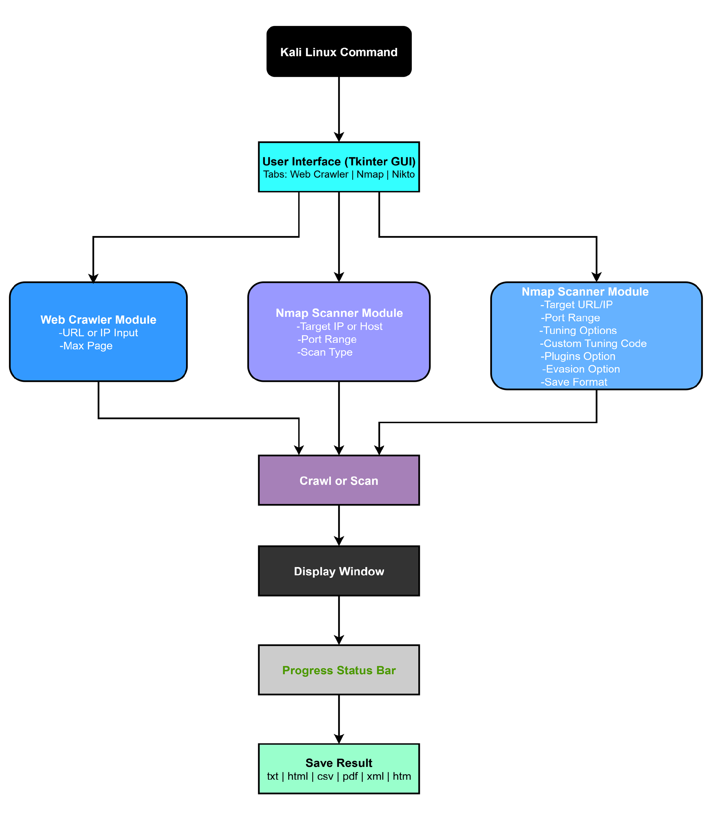
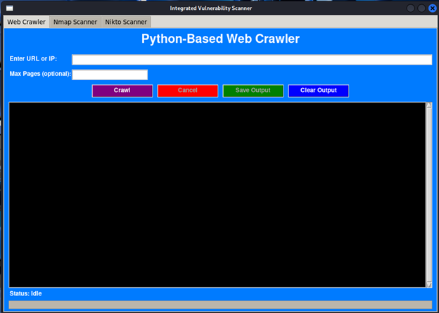
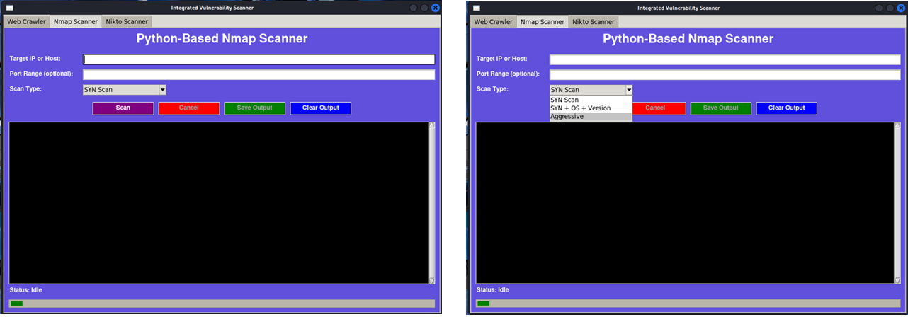
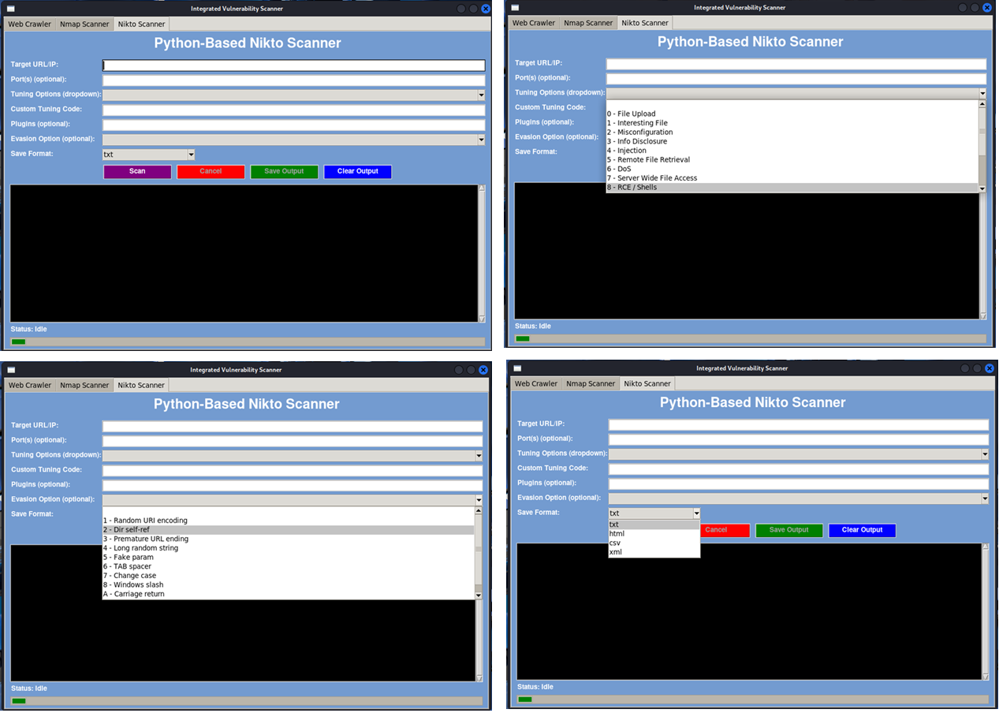

# Python-Based Web Crawler, Port Scanner, and Vulnerability Scanner

## 1) Project Overview
This application integrates three security tools into a single **Tkinter** GUI:
- a **Web Crawler** (Requests + BeautifulSoup),
- an **Nmap Port Scanner**, and
- a **Nikto Vulnerability Scanner**.

The GUI uses a tabbed interface so each tool can be run independently while sharing the same window.

## 2) How It Works (per code)
- The **main GUI** creates a `ttk.Notebook` with three tabs and instantiates each tool's GUI class.
- The **Web Crawler** performs polite crawling of internal links, extracting *Title* and *Description* per page.
- The **Nmap** tab streams live output from the `nmap` subprocess and supports three profiles: *SYN*, *SYN+OS+Version*, and *Aggressive*; optional port ranges are supported.
- The **Nikto** tab builds a `nikto` command with target, optional ports, tuning codes (dropdown/custom), plugins, evasion options, and save format; results are written directly to the chosen file.

## 3) Entry Point
Run the integrated GUI from the combined script (as provided in the repo):
```bash
python vuln_scanner.py
```
> If your repository uses a different combined launcher name (for example `integrated_scanner.py`), run that filename instead:
> ```bash
> python integrated_scanner.py
> ```

## 4) Repository tree and file responsibilities
```
python-capstone-scanner/
├─ README.md                      
├─ SECURITY.md                    
├─ vuln_scanner.py               
├─ gui_crawler.py                 
├─ gui_nmap.py                    
├─ gui_nikto.py                  
├─ webcrawler.py                  
├─ nmap_scan.py                   
├─ requirements.txt              
├─ docs/
│  ├─ Capstone_Summary.pdf        
│  ├─ architecture.png            
│  └─ screenshots/
│     ├─ gui_crawler.png          
│     ├─ gui_nmap.png             
│     └─ gui_nikto.png            
└─ results/
   └─ sample/                    
```

### File purposes (concise)
- `vuln_scanner.py` — Main launcher: builds the Tkinter `Notebook` and loads each GUI tab. Use this as the repository entrypoint.
- `gui_crawler.py` — Crawler tab UI: takes URL input, controls the crawl thread, shows live output, provides Save/Cancel.
- `gui_nmap.py` — Nmap tab UI: accepts target, port range and scan type; streams `nmap` output; supports cancel and save.
- `gui_nikto.py` — Nikto tab UI: builds nikto command line with tuning/plugins/evasion and chosen output format; writes output file.
- `webcrawler.py` — Crawling logic: uses `requests` + `BeautifulSoup`, respects `max_pages`, restricts to internal links, and exposes a stop flag for cancellation.
- `nmap_scan.py` — Runs `nmap` with `subprocess` (uses line buffering), streams output back via callback to the GUI, and supports cancellation.

## 5) Architecture and Screenshots

### 5.1 System Architecture

**Figure 1 — Architecture overview.**  
               
The GUI (top) is the user-facing controller: it collects inputs and starts tasks for the three modules. Each module runs its scanner implementation (crawler, Nmap, Nikto) and streams live output back to the central result display. Shared components (progress indicator, cancel control, and save/export routines) keep the UI responsive and provide a consistent user experience. Exported results are written into the `results/` folder in the selected format (TXT, CSV, PDF, HTML).

**How to read the diagram (short):**
- **GUI (Tkinter)** — single entrypoint that orchestrates modules and receives user actions.  
- **Web Crawler** — fetches pages, extracts titles/meta/links and returns structured results.  
- **Nmap** — runs `nmap` subprocesses, streams stdout/stderr lines to the GUI in real time.  
- **Nikto** — constructs a nikto command with user-selected tuning/options and writes the chosen report format.  
- **Common components** — progress bar, live output window, cancel button, and save/export functions.

---

### 5.2 GUI Screenshots & Explanations

**Web Crawler Tab**  
  
*Explanation:* The Crawler tab accepts a start URL and optional `max_pages`. When a crawl runs it shows a streaming output pane with each visited URL and extracted metadata (Title, Description). A progress indicator shows pages processed and the Cancel button sets the crawler stop-flag to safely terminate the thread. Use *Save* to export the collected records (TXT/CSV/PDF).

**Nmap Scanner Tab**  
  
*Explanation:* The Nmap tab exposes the target field, optional port range, and a scan type selector (SYN, SYN+OS+Version, Aggressive). Starting a scan spawns the `nmap` subprocess and streams line-buffered output into the live pane. The Cancel button terminates the subprocess; Save exports raw `nmap` output to TXT (or PDF if selected).

**Nikto Scanner Tab**  
  
*Explanation:* The Nikto tab allows choosing ports, tuning codes (drop-down or custom), plugins and evasion options. When executed, Nikto runs and writes its report directly to the selected output format (text, HTML, CSV or XML). The GUI shows the running output and lets the user cancel the job.

---

## 6) Installation & Requirements
1. **Install Python packages** (adjust to actual `requirements.txt` if present):
   ```bash
   pip install -r requirements.txt
   ```
2. **Ensure external tools** are available on your PATH:
   - `nmap`
   - `nikto`

## 7) Running the application
```bash
python vuln_scanner.py
```

## 8) Notes and Safe Use
- Use only on systems you own or have explicit permission to test.
- Exported results may contain sensitive information; sanitize before sharing publicly.
- Do not commit real credentials or secrets to the repository.

---
